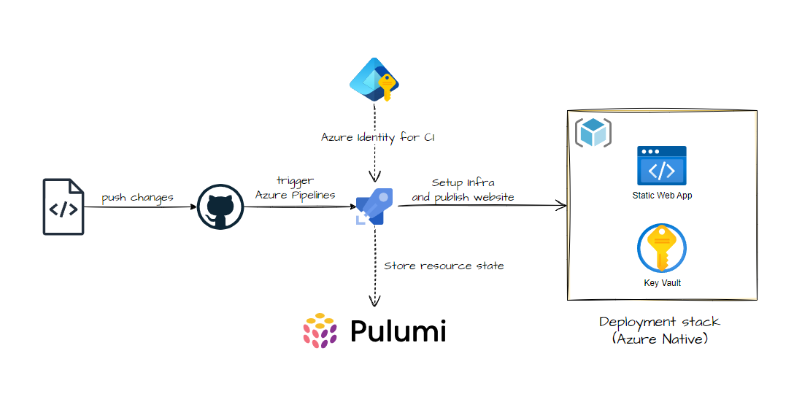
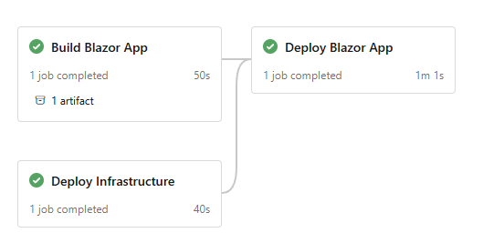
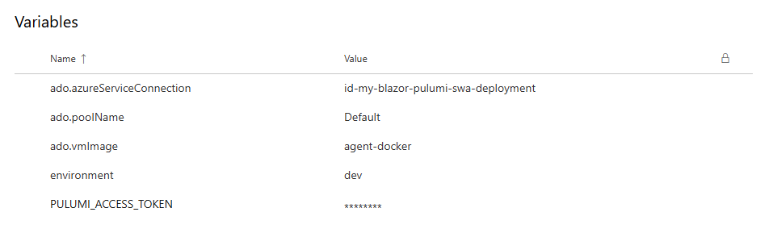
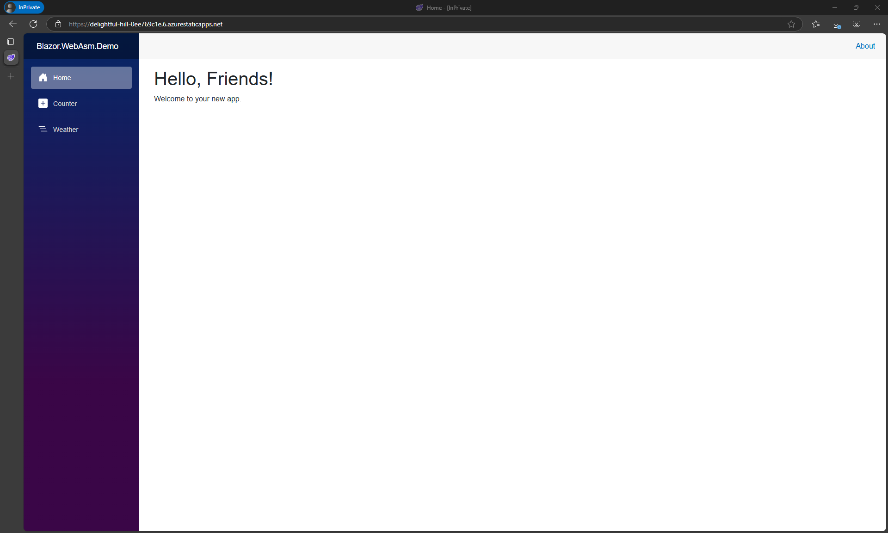

# Fast Static Web App deployment using Pulumi

This repository contains a sample Pulumi project that demonstrates how to deploy a static web app using Azure Static Web Apps. The project is designed to be simple and easy to understand, making it a great starting point for anyone looking to learn about deploying static web apps with Pulumi.

## Architecture Overview



The diagram shows a complete deployment pipeline with the following components:

- GitHub Repository: Source code is stored in GitHub for version control
- Azure Pipelines: Handles CI/CD processes
- Azure Identity/Service Principal: Manages access to Azure resources and assigned to Azure Pipelines
- Azure Static Web App: Hosting platform for the Blazor application
- Azure Key Vault: Securely stores secrets including the Static Web App deployment token
- Pulumi: Infrastructure as Code (IaC) tool used to manage the deployment of the Azure resources

### Worklow

1. Developers write code and push it to GitHub
2. GitHub triggers Azure Pipelines when changes are made
3. Azure Pipelines executes the build and publish Blazor application into build artifact
4. Azure Piplines executes the provision infrastructure using Pulumi
5. During deployment, the pipeline retrieves the Static Web App deployment token from Azure Key Vault
6. The pipeline uses this token to deploy the static content to Azure Static Web App

### Security considerations

To maintain robust security practices, the Static Web App deployment token is securely stored in Azure Key Vault rather than being hardcoded in pipeline files. During the deployment process, Azure Pipelines retrieves this token directly from Key Vault, ensuring sensitive credentials remain protected and follow security best practices for secret management throughout the CI/CD workflow.


## Development

This project is designed to be easy to set up and run locally. You can use either a DevContainer or set up the environment manually.


## Development with DevContainer

This project supports development using Visual Studio Code DevContainers, which provides a consistent development environment for all contributors.

### Prerequisites for DevContainer

- [Docker](https://www.docker.com/products/docker-desktop)
- [Visual Studio Code](https://code.visualstudio.com/)
- [Remote - Containers extension](https://marketplace.visualstudio.com/items?itemName=ms-vscode-remote.remote-containers)

### Starting the DevContainer

1. Clone this repository
2. Open the repository in Visual Studio Code
3. When prompted, click "Reopen in Container" or run the "Remote-Containers: Reopen in Container" command from the command palette
4. The container will build and start, which may take a few minutes the first time
5. Once the container is ready, you'll have a fully configured development environment

## Manual Setup

If you prefer not to use DevContainers, follow these steps:


- .NET SDK 9.0.200 or compatible
  - [Install .NET SDK](https://dotnet.microsoft.com/download/dotnet)
- Pulumi CLI
  - [Install Pulumi](https://www.pulumi.com/docs/get-started/install/)


## How to run the project

### Working with Blazor Application project

This project uses a Blazor WebAssembly app as the static web app. The Blazor app is built using the .NET CLI and is deployed to Azure Static Web Apps.

Location: `src/BlazorApp.slnx`

#### Run the Blazor app locally

```bash
cd src/Blazor.WebAsm.Demo

dotnet run
```

#### Publish the Blazor app

We need to publish the Blazor app before deploying it to Azure Static Web Apps. The publish command will create a `publish` folder containing the static files needed for deployment.


```bash
cd src/Blazor.WebAsm.Demo

dotnet publish -c Release -o ./publish
```

### Working with Pulumi project

This project uses Pulumi to manage the deployment of Azure resources. The Pulumi project is located in the `infra/pulumi` folder.

Location: `/infra/pulumi/Blazor.Infra.Pulumi`

**Select a stack:**

  ```bash
  pulumi stack select dev
  ```

**Preview changes to the current stack:**

  ```bash
  pulumi preview
  ```

**Deploy changes to the current stack or specified stack:**

  ```bash
  pulumi up

  # or to deploy to a specific stack
  pulumi up --stack <stack-name>
  ```


## CI/CD with Azure Pipelines

This project uses Azure Pipelines for continuous integration and continuous deployment (CI/CD). The pipeline is defined in the `.azdo/pipelines/deploy-to-swa.yaml` file.

### Pipeline Stages


### Variables
The pipeline uses several variables to manage the deployment process. These variables are defined in the Variable Groups in Azure DevOps. The following variables are used in the pipeline:



## Browse to website

After the deployment is complete, you can browse to the static web app using the URL provided in the Azure portal or in the output of the `pulumi up` command.


